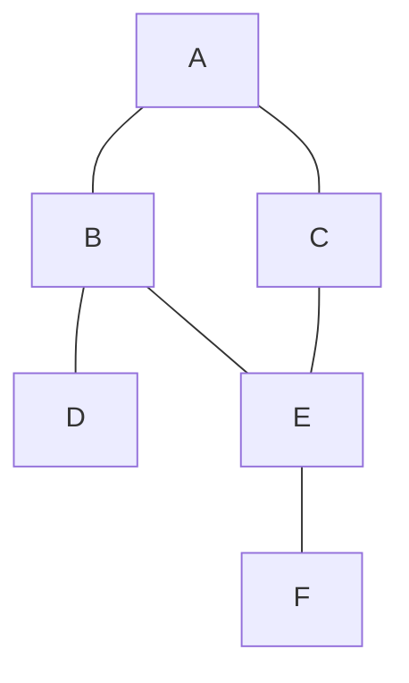

# Graph Search Activity 10

## Task 1: Theoretical Graph

For this activity, I created a simple undirected graph with six vertices. Each vertex represents a location, and each edge represents the path between two locations.

The graph below contains 6 vertices: A, B, C, D, E, and F.



### Description of the graph

- Vertex A is connected to B and C
- Vertex B is connected to A, D, and E
- Vertex C is connected to A and E
- Vertex D is connected to B
- Vertex E is connected to B, C, and F
- Vertex F is connected to E

This graph is undirected, which means the connection works both ways. If A connects to B, then B also connects back to A.

---

## Task 2: C++ Implementation of BFS and DFS

The graph was made using an adjacency list. Each vertex stores a list of the vertices connected to it.

Breadth-first search uses a queue to visit vertices level by level. Depth-first search uses a stack to go deeper into one path before backtracking.

```cpp
#include <iostream>
#include <map>
#include <vector>
#include <queue>
#include <stack>
#include <set>
using namespace std;

void bfs(map<char, vector<char>> graph, char start) {
    queue<char> q;
    set<char> visited;

    q.push(start);
    visited.insert(start);

    cout << "BFS starting from " << start << ": ";

    while (!q.empty()) {
        char current = q.front();
        q.pop();

        cout << current << " ";

        for (char neighbor : graph[current]) {
            if (visited.find(neighbor) == visited.end()) {
                visited.insert(neighbor);
                q.push(neighbor);
            }
        }
    }

    cout << endl;
}

void dfs(map<char, vector<char>> graph, char start) {
    stack<char> s;
    set<char> visited;

    s.push(start);

    cout << "DFS starting from " << start << ": ";

    while (!s.empty()) {
        char current = s.top();
        s.pop();

        if (visited.find(current) == visited.end()) {
            visited.insert(current);
            cout << current << " ";

            for (int i = graph[current].size() - 1; i >= 0; i--) {
                char neighbor = graph[current][i];
                if (visited.find(neighbor) == visited.end()) {
                    s.push(neighbor);
                }
            }
        }
    }

    cout << endl;
}

int main() {
    map<char, vector<char>> graph;

    graph['A'] = {'B', 'C'};
    graph['B'] = {'A', 'D', 'E'};
    graph['C'] = {'A', 'F'};
    graph['D'] = {'B'};
    graph['E'] = {'B', 'F'};
    graph['F'] = {'C', 'E'};

    bfs(graph, 'A');
    dfs(graph, 'A');

    return 0;
}
```

---

## Program Output

```text
BFS starting from A: A B C D E F
DFS starting from A: A B D E F C
```

The BFS output starts at A, then visits B and C because they are directly connected to A. After that, it visits the next closest vertices.

The DFS output starts at A and follows one path as far as possible before going back and checking other paths.

---

## Task 3: Big-O Comparison

Both BFS and DFS have a time complexity of:


O(V + E)


V represents the number of vertices and E represents the number of edges.

BFS visits each vertex one time and checks the edges connected to each vertex. Since every vertex and edge may need to be checked, the runtime is O(V + E).

DFS also visits each vertex one time and checks the edges connected to each vertex. Even though DFS explores the graph differently from BFS, it still has the same overall time complexity of O(V + E).

The main difference between the two algorithms is the order in which they visit vertices. BFS uses a queue and searches level by level. DFS uses a stack and searches deeply through one path before backtracking.

---

## Conclusion

This activity showed how a graph can be represented using an adjacency list in C++. I created a simple graph, implemented both breadth-first search and depth-first search, and compared their Big-O time complexities. Even though BFS and DFS visit vertices in different orders, both algorithms have a time complexity of O(V + E) when using an adjacency list.
