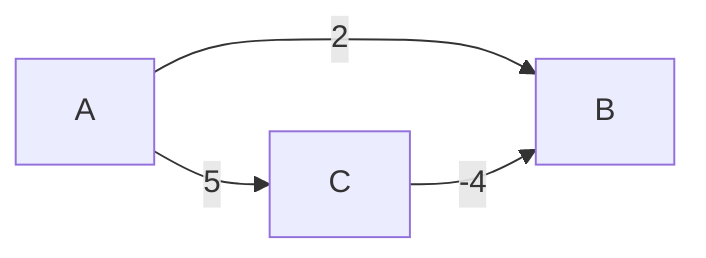

# Activity 2: Dijkstra's Algorithm and Negative Weights

## Objective

The objective of this activity is to explain why Dijkstra's algorithm can fail when a graph contains negative edge weights.

## What Dijkstra's Algorithm Does

Dijkstra's algorithm is used to find the shortest path from one starting vertex to the other vertices in a graph. It works by repeatedly choosing the unvisited vertex with the smallest current distance.

This works well when all edge weights are positive or zero. However, the algorithm can give the wrong answer when negative edge weights are included.

## Example Graph

Here's a graph to represent this example:



The edges are:

- A to B has a weight of 2
- A to C has a weight of 5
- C to B has a weight of -4

## Why Dijkstra's Algorithm Fails

Starting from vertex A, Dijkstra's algorithm first checks the distances to the neighboring vertices.

From A:

- Distance to B is 2
- Distance to C is 5

Since 2 is smaller than 5, Dijkstra's algorithm chooses B first and treats the distance to B as finalized.

However, there is another path to B:

```text
A -> C -> B
```

The total cost of that path is:

```text
5 + (-4) = 1
```

So the path from A to C to B has a total cost of 1, which is shorter than the direct path from A to B with cost 2.

The problem is that Dijkstra's algorithm already finalized B too early. Because of the negative edge from C to B, a better path to B was found later, but Dijkstra's algorithm does not properly handle that situation.

## Correct Shortest Path

The direct path is:

```text
A -> B = 2
```

The better path is:

```text
A -> C -> B = 1
```

Therefore, the correct shortest path from A to B is:

```text
A -> C -> B
```

with a total cost of:

```text
1
```

## Conclusion

Dijkstra's algorithm fails on graphs with negative edge weights because it assumes that once a vertex has the smallest known distance, that distance will not need to change later. Negative weights break this assumption because they can create a shorter path after a vertex has already been finalized.

For graphs with negative weights, a different algorithm, such as the Bellman-Ford algorithm, should be used instead.
